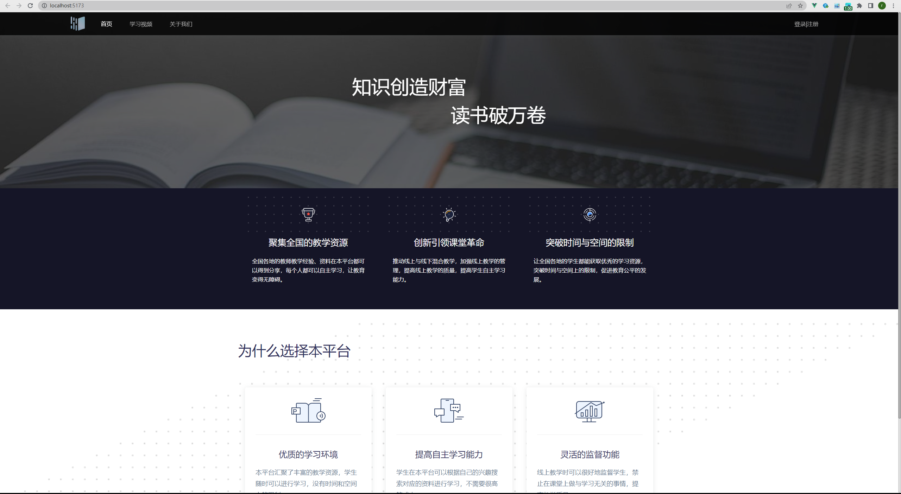
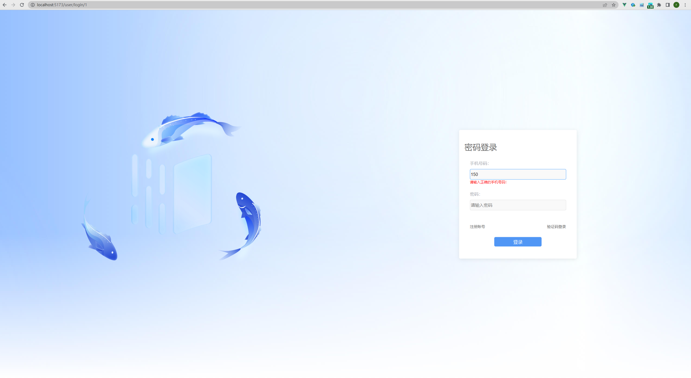
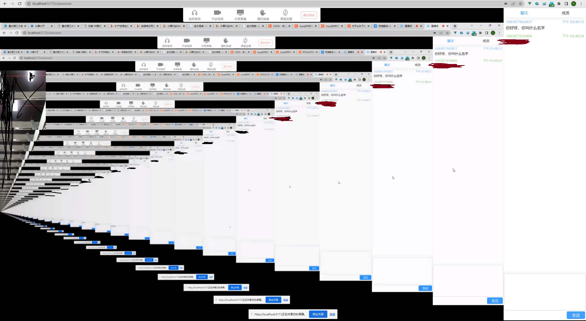
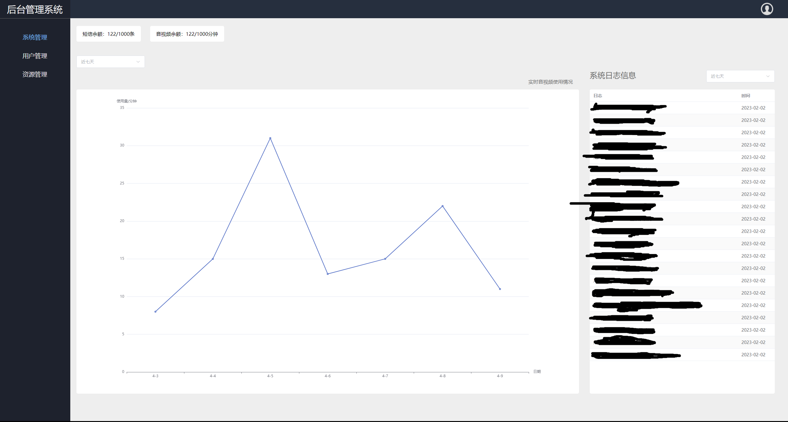

# 在线直播教学平台

&nbsp;&nbsp;&nbsp;&nbsp;&nbsp;&nbsp;&nbsp;&nbsp;这是一款基于Vue+Spring boot实现的在线直播教学平台，是个人的毕业设计。该项目完成了屏幕分享、音视频分享、随机抽查、教学监督、身份验证、登录注册、班级管理、视频搜索与播放等功能，其中音视频分享和屏幕分享调用了腾讯云实时音视频API。

&nbsp;&nbsp;&nbsp;&nbsp;&nbsp;&nbsp;&nbsp;&nbsp;项目的组成如下：

- back-end：后端代码，包括用户部分和管理员部分。

- front-end：用户部分的前端代码。
- front-end-admin：管理员部分的前端代码。

## 1.项目开发相关信息

- 开发软件：IDEA、WebStorm、Chrome。
- 开发环境：jdk-1.8、node-18.16.1（目前使用的，项目具体忘记了，但至少是18.15+）
- 相关技术栈：
  - 前端：Vue3（Vuex、Vue-Router）、Element-Plus、Vite
  - 后端：Spring boot、Mybatis、MySQL、Redis、Ansj（一种分词器）、WebSocket

## 2. 项目效果图

图1-系统首页

图2-登录页面

图3-直播教学页面

图4-管理员登录页面

图5-后台管理首页

以上是对项目的整体介绍，项目该有的功能都全部完成，但有些小细节没来得及优化，代码还是比较冗余，需要用的朋友可以自己优化一下吧。各位朋友觉得写的不错的话（个人觉得写的很拉）可以给个star吗，哈哈哈！如果不懂的话可以联系我：neverctrlcv@outlook.com
